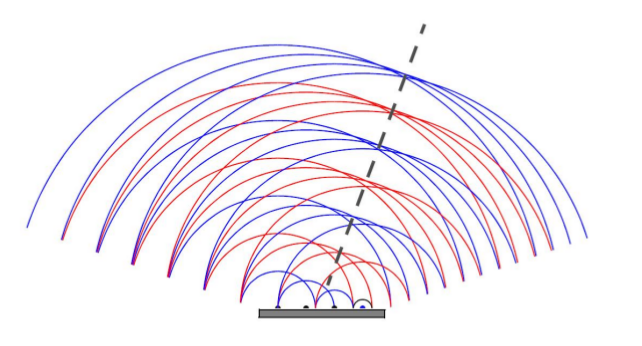
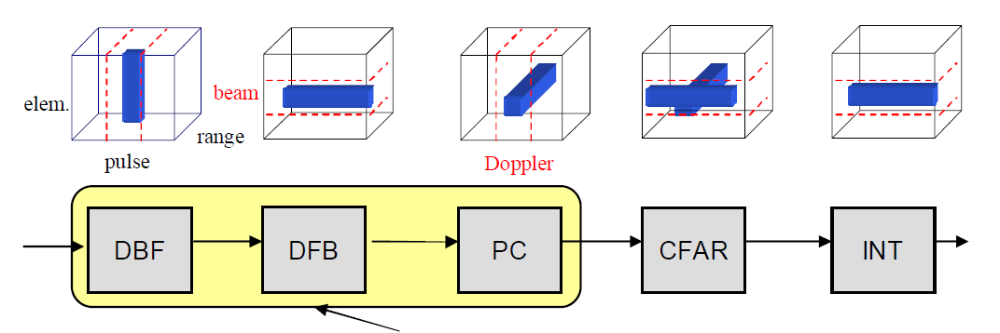
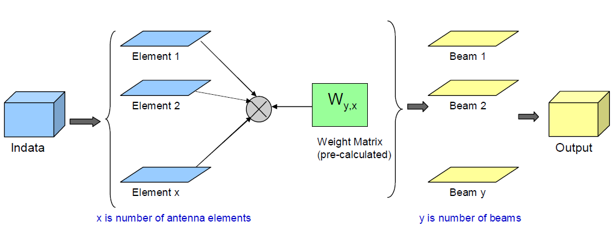
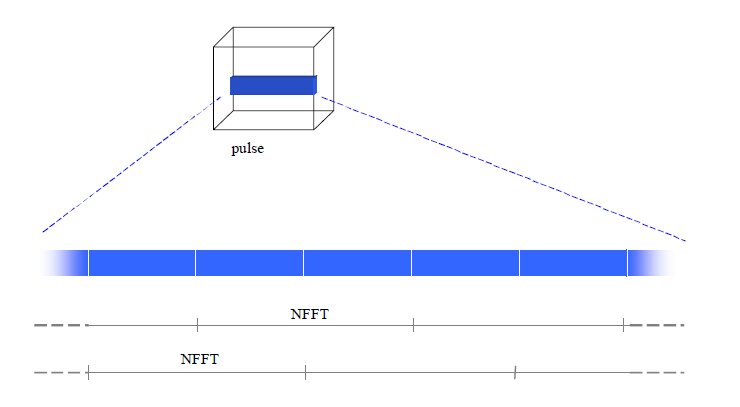
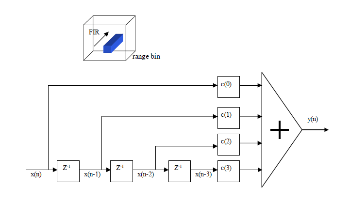

% CAL implementation for AESA
%
% 2014-01-18

<!---  This repo holds the statistics about the first three blocks (matrix, fft, -->
<!---  fir) in aesa. -->

# Overview
An AESA may consist of hundreds, or thousands, of antenna elements. The function
of an AESA is illustrated in Figure \ref{f:aesa}. The relative phases of the
pulses of the different antenna elements are set to create a constructive
interference in the chosen main lobe bearing. In this way the pointing direction
can be set without any moving parts. When receiving, the direction can be
steered by following the same principle (see the Digital Beam Former below). One
of the main advantages of the array antennas is the capacity to extract not only
temporal but also spatial information, i.e. the direction of incoming signals.

Figure \ref{f:chain} presents the simplified radar signal processing chain,
among which only the first three blocks are discussed in this report for they
have more parallelism to exploit.

Three applications corresponding to the three blocks are implemented using CAL
^[Available at https://github.com/albertnetymk/JUMP_CAL], and are running on
Epiphany by utilizing the front end from Lund University and C Code Generator
from Halmstad University. This report will summarize the development process on
the three applications: `matrix`, `fft`, `fir`. (These are the essential
mathematical operations behind each block.)

Before the CAL version development starts, there's already one functional matlab
implementation, so all the input/output data these apps used are obtained from
that.

# Digital Beam Former (DBF)

* Input data size: [951 x 256 x 16]
* Weight size: [16 x 8]
* Output data size: [951 x 256 x 8]

Observing the dimension of all the data, we could see simple matrix
multiplication is enough to satisfy the matrix size requirement. However,
implementing this in low level languages force us to make some decision, which
also provides one opportunity to make it faster. Two major changes are discussed
below.

## Matrix to stream
Since CAL is one dataflow language, it makes sense to view data flows through all the nodes like one stream. Therefore, we will provide 1D array
(stream) instead of 2D matrix as the input. This change doesn't affect the internal implementation of the actor, but it's much easier to reason in
dataflow language with data in stream format.

## Broadcasting input data
Since the output is 6 images (2D matrix), one simple and straightforward way to
parallelize this application could be appointing each image to one core, which
is the approach this implementation uses. If one dives into the internal of this
matrix multiplication, one will realize that all 6 cores (nodes) use the same
input data, with only weights different. Therefore, we could broadcast the input
data to all the 6 cores, resulting into SIMD configuration

# Doppler Filter Bank (DFB)

* Input data size: [951 x 256 x 8]
* Weight size: [32 x 1]
* Output data size: [951 x 512 x 8]

Continuing our journey using the result from previous app, we have more or less the same network graph, with only nodes different. The same operation
is performed on all the input images, so we just describe the process with one image [951 x 256]. For easy understanding, we will try to understand
the process firstly without caring too much about the performance.

## Concrete steps in this block

1. Denote the input image as A.
2. Duplicate A to create B', with one margin [: x 16] striped on left and right margin.
3. Append B' with zero padding on right side to create B so that both A and B have the same size.
4. Pick 32 columns from A, and do dot product on each row using weights, and perform FFT on each row to generate 32 columns for output image.
5. Do dot product and FFT on 32 columns from B to generate 32 columns for output image.
6. Repeat until both A and B are finished.

While implementing this block, it's not necessary to create B, for B is more or less one shifted version of A. Therefore, we could just buffer some
data inside the actor to perform step 4 and 5.

## Stream
Using the same argument from previous block, we convert 2D images into stream as well. Considering the order how input data is needed, it's efficient
to rearrange images as chunks with each chunk as 32 columns. This way, we could obtain result as we pipe the data into this block, like one stream.

# Pulse Compression (PC)

* Input data size: [951 x 512 x 8]
* Weight size: [105 x 1]
* Output data size: [951 x 512 x 8]

This block accepts result from previous block, and performs mainly FIR onto it. Similarly, we will firstly describe the steps on one rather high
level.

## Concrete steps in this block

1. Put zero padding on top and bottom of input image A, with each padding 102 rows, so that the row becomes `951 + 102 x 2`.
2. Perform inner filtering using input weight on each column, then the resulting image is back to 951 rows.

## Stream
In this block, we will construct stream from each column, since it works columnwise. It's not necessary to do the zero padding when we really
implement this block, but extra care needs to be taken on the beginning and ending of each column. At beginning, only bottom half of weight array is
used, for the other half would be used on `0`. On ending of this column (before starting of next column), we have to gradually use the top half of
weight array to mimic the shift of FIR taps.

# Result

Utilizing the CAL tool chain for Epiphany, we run the three applications on
physical Epiphany chip, where each core is operating on 400MHz, provided by
Adapteva Inc. We are measuring the complete transaction duration, starting from
the first token consumed to the last token emitted. ^[Complete raw data could be
found at https://github.com/albertnetymk/JUMP_data]

## Digital Beam Former (DBF)

4000 tokens are used from each input image, and 64000 (16x4000) tokens totally,
for there are 16 input images. The total duration is around 438 million cycles
(0.73 second)

## Doppler Filter Bank (DFB)

7680 (32x240) tokens (has to be multiple of 32 because FFT operates on 32 tokens
per time) are used from each input image, and 61440 (8x32x240) tokens totally,
for there are 8 input images. The total duration is around 199 million cycles
(0.33 second)

## Pulse Compression (PC)

8559 (951x9) tokens (has to be multiple of 951 because FIR operates on 951
tokens per time)are used from each input image, and 68472 (8x951x9) tokens
totally, for there are 8 input images. The total duration is around 437 million
cycles (0.73 second)

